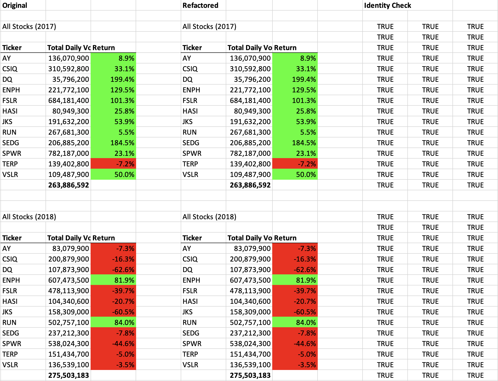
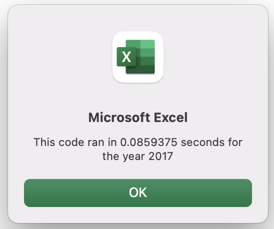
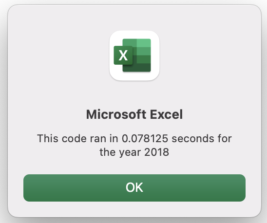

# VBA of Wallstreet
Analysis of stock market data for Steve

## Overview of Project
Steve wanted to determine whether his parents' interest in the stock Daqo (ticker DQ) warranted investment. He next expanded his interest to 11 other stocks over two years. Now Steve wants to further expand his analysis to the entire stock market over the past several years.

### Purpose
Although the initial Visual Basic for Applications (VBA) script works well for a dozen stocks, Steve worries that it may take prohibitively long to run the analysis on thousands of stocks. Here the initial VBA script is refactored to execute faster.

## Results

### Stock Performance Between 2017 and 2018
#### Yearly Return
2017 was a good year, with all stocks showing a positive yearly return except for ticker TERP. 2018 was just the opposite, with all stocks showing a negative yearly return except for tickers ENPH and RUN. 

#### Total Daily Volume
The analysis was not optimized to assess total daily volumes. However, one can calculate the average total daily volume, which was roughly 264,000,000 shares in 2017 and 276,000,000 shares in 2018. The difference is not that significant, and total daily volume usually increases from year to year.

### Refactoring Implementation

#### Refactoring Preserves Deliverables
To more easily show that the original (AllStocksAnalysis) and refactored (AllStocksAnalysisRefactored) scripts produce the same output, the worksheet "Analysis Identity" was created. Both scripts were run for years 2017 and 2018 (four separate analyses). The four results were pasted into "Analysis Identity", and cell to cell comparisons were made. The cells from the original script were identical to the cells from the refactored script:

### Refactoring Calculations and Predictions
This section contains calculations which predict how much faster the refactored script might run than the original script. 

#### Refactoring Importance
The refactoring allows the raw data of each stock to be scanned for content only once instead of multiple times.

#### Before Refactoring
Let $ n = 12 $ be the number of stocks. The original script first scans ticker AY. Next it scans ticker AY again and ticker CISQ. Next it scans ticker AY yet again, ticker CISQ again, and ticker DQ. In all it must perform $ n (n+1) / 2 = 78 $ scans, a complexity $O(n^2)$ algorithm.

#### After Refactoring
However, the refactored script requires just $n = 12$ scans, a complexity $O(n)$ algorithm. 

#### Refactoring Speedup
The "refactoring speedup" is the ratio of the number of the before and after refactoring scans, which is $ (n+1) / 2 = 6.5 $, which is pretty good for Steve's $ n = 12 $ analysis. However, Steve wants to analyze thousands of stocks. If $ n = 1000 $, the speedup is $ (1000 + 1) / 2 = 500.5 $! Steve was right to worry about the necessity of refactoring the original script.

### Results from the Original VBA Script
The original VBA script AllStocksAnalysis was run for years 2017 and 2018, and messagebox data were recorded (messageboxes not shown). The 2017 analysis ran in 0.504 seconds, and the 2018 analysis ran in 0.498 seconds. One would expect the two analyses to complete in about the same time, as both 2017 and 2018 contain 3012 rows of raw data. The difference between the two times was 6 milliseconds, which is close to the precision of the `Timer` function:
> The `Timer` VBA function returns the number of seconds elapsed since midnight with a precision of 1/256th of a second (3.90625 milliseconds)
>
> <cite>https://riptutorial.com/excel-vba/example/6187/use-timer-to-find-bottlenecks-in-performance</cite>

### Results from the Refactored VBA Script
The refactored VBA script AllStocksAnalysisRefactored was run for years 2017 and 2018, and messagebox images were captured in the two screenshots below. The 2017 analysis ran in 86 milliseconds, and the 2018 analysis ran in 78 milliseconds. The difference between the two times was 8 milliseconds, again a negligible difference:

Year 2017 Refactored (86 ms) | Year 2018 Refactored (78 ms)
:-----:|:-----:
 | 

### Actual Refactoring Speedup
The 2017 speedup is $504 / 86 = 5.9$ times as fast. The 2018 speedup is $498 / 78 = 6.4$ times as fast. The average speedup over the two years is $(504 + 498) / (86 + 78) = 6.1$ times as fast.

## Summary

### General Notes on Refactoring Code
When code is refactored, it does not in principle change inputs, outputs, or deliverables. Although code refactoring takes extra time up front for the developer, it more than pays for itself in the long run. Code is refactored to improve, among other things, execution time (faster), resource usage, and code base maintenance. Code that is too slow might be refactored to be usable; code that is too expensive to run might be refactored to run within budget; code that is written obscurely or poorly documented might be refactored to be more easily maintained.

### Comparison Between the Original and Refactored VBA Script
#### The Refactored Script is Faster
The only disadvantage of the refactored script was the two hours of time required to do the actual refactoring. The refactored script performed the analysis about 6.1 times faster than the original script, which is quite close to the predicted refactoring speedup of 6.5.

#### The Refactored Script is Easier to Maintain
Suppose your are supplied with raw data on not 12 but 100 stocks. To modify the refactored script just requires doing a find/replace on all magic numbers 12 and 11 to 100 and 99. Of course one could easily refactor further (not done here), and place magic number 12 into variable `numStocks = 12` and replace magic number 11 with `numStocks - 1`. (Also, the tickers array would need to be updated.)
